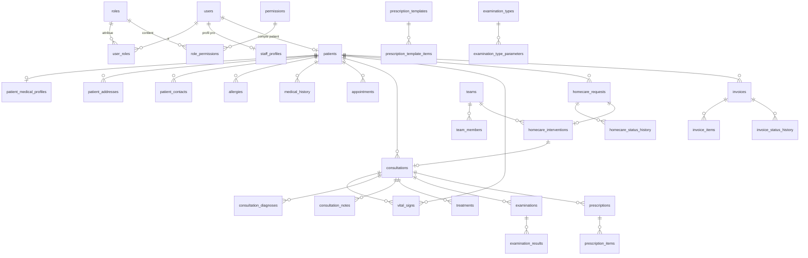

# VISION HOMECARE — Rapport initial (Phase 1 : Analyse & Architecture)

> Version 0.1 — 2026-09-25
> Statut : validé le 2026-09-25, avec les décisions D-001 à D-008 du [journal des décisions](01_DECISIONS.md) (qui prévalent sur ce document).

---

## 0. État du workspace et de l'environnement

| Élément | Constat | Conséquence |
|---|---|---|
| Workspace `vsh_niger/` | Vide (uniquement le cahier des charges `nouveau 13.txt` / `prompte.docx`) | Projet démarré de zéro. `vsh_niger/` joue le rôle de racine `VISION_HOMECARE/` |
| PHP local | 8.2.12 (XAMPP) — PDO, pdo_mysql, openssl, mbstring, fileinfo, gd, curl, zip présents ; **sodium absent** ; imagick mal configuré (warning) | Code écrit strictement en **syntaxe PHP 7.3** (pas de propriétés typées, `fn()`, `match`, `?->`, arguments nommés, union types, `str_contains`). Crypto via `random_bytes`, `hash_hmac`, `password_hash`, `openssl_*` |
| Base de données | MariaDB 10.4.32 (port 3306 actif) | InnoDB, `utf8mb4_unicode_ci`, colonnes JSON (LONGTEXT + CHECK sur MariaDB) |
| Serveur web | Apache (port 80 actif) | Front controller + `.htaccess` |
| Composer | 2.8.11 | Autoload PSR-4 uniquement ; **zéro dépendance runtime** au départ ; PHPUnit 9 en dev (compatible 7.3). `config.platform.php = 7.3` pour garantir la compatibilité |
| Flutter | 3.44.0 / Dart 3.12, toolchain Android OK ; iOS non testable sous Windows | Développement/test Android ; iOS à valider sur macOS |
| Réseau | pub.dev injoignable au moment de l'inspection | À vérifier avant `flutter create` / `pub get` |

---

## A. Analyse fonctionnelle — modules

| # | Module | Contenu | Offline mobile |
|---|---|---|---|
| 1 | **Auth & Sessions** | Login téléphone + mot de passe / OTP, tokens, refresh, appareils, verrouillage local, récupération d'accès | Session locale (PIN/biométrie) |
| 2 | **Utilisateurs & Droits** | Comptes, profils professionnels, rôles, permissions (RBAC en base), activation/désactivation | Lecture (profil) |
| 3 | **Référentiels** | Services, actes médicaux, types de soins, types d'examens (+ paramètres/normes), médicaments, moyens de paiement, tarifs datés, paramètres | Lecture (cache) |
| 4 | **Patients** | Identité, n° dossier, contacts, adresses + GPS + repère, antécédents, allergies, traitements en cours, observations, historique | Lecture + création/modification |
| 5 | **Rendez-vous** | Créneaux par service, demande, confirmation, déplacement, annulation, affectation | Lecture + demande en file |
| 6 | **Consultations** | Workflow complet (constantes → clôture), types clinique/domicile/suivi/urgence | **Complet offline** |
| 7 | **Homecare** | Demandes à domicile, GPS, dispatch équipes, machine à états, navigation, intervention | Complet offline (transitions revalidées serveur) |
| 8 | **Équipes mobiles** | Équipes, membres, disponibilité | Lecture |
| 9 | **Soins** | Actes de soins liés ou non à une consultation | Complet offline |
| 10 | **Examens** | Prescription, file technicien, résultats structurés, pièces jointes, validation | Complet offline (fichiers en file d'upload) |
| 11 | **Ordonnances** | Prescriptions, lignes, modèles configurables, PDF | Complet offline |
| 12 | **Facturation** | Factures, lignes (snapshot prix), statuts, historique ; paiements **hors plateforme**, état de règlement déclaratif (D-004) | Brouillon offline ; numérotation définitive serveur |
| 13 | **Notifications** | In-app (table), locales, push optionnel (FCM), récupération au pull | Locales |
| 14 | **Synchronisation** | Outbox, push/pull incrémental, idempotence, conflits, supervision admin | Cœur du mobile |
| 15 | **Dashboard & Rapports** | KPI, graphiques, filtres de période, activité par équipe/professionnel | Web (mobile : mini-dashboard perso) |
| 16 | **Carte** | Interventions géolocalisées, couleurs par statut, clustering, popup non sensible | Web admin |
| 17 | **Audit & Logs** | Journal des actions sensibles, logs techniques, journal de sync | — |
| 18 | **Portail web patient** | Dossier, RDV, demande à domicile, factures | — |

---

## B. Acteurs et permissions

### Principe
- **RBAC stocké en base** : `roles`, `permissions`, `role_permissions`, `user_roles`. Le code ne connaît que des **codes de permission** (`patient.read`, `consultation.create`…) ; l'association rôle → permissions est modifiable par l'admin. Aucun rôle codé en dur dans la logique.
- **Contrôle à deux niveaux**, toujours côté serveur :
  1. *Permission* : l'utilisateur a-t-il le droit d'effectuer l'action ?
  2. *Portée (row-level)* : sur quelles lignes ? (un patient ne voit que son dossier ; un technicien ne voit que sa file d'examens ; une équipe ne voit que ses interventions + les demandes ouvertes).
- Implémenté par des classes **Policy** par module, appelées depuis les services.

### Rôles proposés (seeds initiaux, modifiables)

| Permission (groupes) | ADMIN | MÉDECIN | INFIRMIER | TECHNICIEN | ACCUEIL* | PATIENT |
|---|:-:|:-:|:-:|:-:|:-:|:-:|
| Utilisateurs / rôles / paramètres | ✔ | | | | | |
| Valider comptes patients | ✔ | | | | ✔ | |
| Référentiels (actes, soins, examens, médicaments, tarifs) | ✔ | lecture | lecture | lecture (examens) | lecture | |
| Modèles d'ordonnance | ✔ (+ médecin référent) | utilisation | | | | |
| Patients — identité | ✔ | CRUD | CRU | minimale | CRU | soi-même |
| Patients — données médicales | selon fonction** | ✔ | utiles aux soins | ✘ (sauf utile à l'examen) | ✘ | soi-même |
| Rendez-vous | ✔ | les siens | les siens | | ✔ | demande/annulation |
| Consultations | lecture | ✔ | constantes, lecture | | ouverture | lecture (clôturées) |
| Diagnostic / prescription | | ✔ | | | | lecture |
| Soins | lecture | ✔ | ✔ | | | lecture |
| Examens — prescrire | | ✔ | | | | |
| Examens — réaliser / saisir | | | | ✔ | | |
| Examens — valider (D-005) | | médecin traitant / prescripteur / équipe en charge | équipe en charge | ✘ (jamais ses propres résultats) | | résultats **validés** |
| Homecare — demander | ✔ | ✔ | ✔ | | ✔ | ✔ |
| Homecare — accepter / transitions (D-003) | affecter | membres d'équipe | membres d'équipe | | dispatch | annuler avant prise en charge |
| Facturation (D-004) | ✔ | | | | création / émission | lecture des siennes |
| Dashboard / carte / rapports | ✔ | perso | perso | perso | partiel | |
| Audit / supervision sync | ✔ | | | | | |

\* *ACCUEIL* est un rôle ajouté : dans une clinique réelle, l'accueil n'est ni le médecin ni l'administrateur technique. (Le rôle CAISSIER initialement proposé est abandonné : paiements hors plateforme, D-004.)
\** L'ADMIN technique ne voit pas automatiquement le contenu médical : on distingue `admin.*` (gestion) de `medical.read_all` (attribuable à un médecin-chef).

---

## C. Workflows

### C1. Inscription patient
```
[App/Web] Formulaire (nom, prénom, sexe, date de naissance, téléphone, quartier, repère, contact d'urgence, mot de passe)
   ↓ vérification du téléphone par OTP (si activé)
   ↓ users(status=PENDING) + patients(status=PENDING, file_number=NULL)
   ↓ détection de doublons (téléphone ; nom + date de naissance) → signalée à l'admin
   ↓ notification "compte en attente de validation"
```

### C2. Validation patient (admin / accueil)
```
Comptes en attente → fiche + doublons potentiels
   ├─ Valider  : n° dossier attribué par séquence serveur (ex. VSH-2026-000123), status=ACTIVE, notification
   ├─ Fusionner: rattacher le compte à un dossier existant (patient déjà connu en clinique)
   └─ Rejeter  : motif + notification
Audit à chaque étape.
```

### C3. Rendez-vous
```
Patient : service → date → créneau libre (calculé serveur : plages du service − RDV existants) → motif
   ↓ DEMANDE
Accueil/Admin : CONFIRME (+ professionnel) | DEPLACE (notification) | ANNULE (motif)
Patient : ANNULE possible jusqu'à X heures avant (paramètre)
Jour J : ARRIVE → consultation liée → HONORE | ABSENT
```

### C4. Consultation
```
OUVERTE (accueil ou médecin, avec ou sans RDV)
 → constantes (plusieurs mesures possibles) → motif/symptômes → examen clinique → diagnostic(s)
 → ordonnance (modèle ou libre) → demandes d'examens → soins
 → CLOTUREE (verrouillée : toute correction = addendum tracé)
 → facture brouillon générée à partir des actes/soins/examens
Types : CLINIQUE | DOMICILE | SUIVI (lien vers la consultation parente) | URGENCE (si activé)
```

### C5. Consultation à domicile
```
Patient (ou accueil) : besoin + urgence + GPS (lat, lng, précision, horodatage) + adresse/repère + téléphone
   ↓
NOUVELLE ──(validation auto ou manuelle)──→ EN_ATTENTE (visible des équipes autorisées)
   ↓ acceptation par une équipe (verrou serveur : la première gagne) OU affectation par le régulateur
PRISE_EN_CHARGE → EN_ROUTE (navigation GPS) → SUR_PLACE (position de l'équipe capturée)
   → EN_COURS (consultation DOMICILE : constantes, soins, ordonnance, examens)
   → TERMINEE → FACTUREE
Sorties : ANNULEE_PATIENT (avant SUR_PLACE) | ANNULEE_CLINIQUE (motif) | ECHEC (absent, adresse introuvable, refus… ; motif obligatoire)
Retour possible : PRISE_EN_CHARGE → EN_ATTENTE (désistement d'équipe, motif)
```
Chaque transition est historisée (`homecare_status_history` : de, vers, qui, quand, position). La machine à états est **définie côté serveur** ; le mobile applique les transitions de façon optimiste, le serveur les revalide à la synchronisation.

### C6. Soins
```
Depuis une consultation, une intervention ou un soin programmé (ex. pansement quotidien)
Type (référentiel) → date/heure → professionnel → observations → REALISE → ligne facturable (tarif en vigueur à la date)
```

### C7. Examens
```
PRESCRIT (médecin) → EN_ATTENTE (file labo/technicien) → EN_COURS → TERMINE (résultats + pièces jointes)
→ VALIDE (habilité) → visible du patient + notification "résultat disponible"
Un résultat non validé n'est jamais visible par le patient.
```

### C8. Ordonnance
```
Depuis la consultation → "Appliquer un modèle" (filtré par pathologie / tranche d'âge / poids)
→ lignes pré-remplies ENTIÈREMENT modifiables → alertes informatives (allergies connues)
→ signature par le prescripteur (responsable final) → PDF / partage
Modèles = données configurées et versionnées par l'administration / le médecin référent, jamais codées en dur.
```

### C9. Facturation
```
BROUILLON (auto ou manuel ; prix = copie du tarif en vigueur)
→ EMISE (n° définitif attribué par le serveur, ex. FAC-2026-000045) → transmise au patient (app / portail, PDF)
→ ANNULEE (motif obligatoire ; jamais supprimée)
Paiement : hors plateforme (D-004). État de règlement déclaratif pour le suivi des impayés :
NON_REGLEE → PARTIELLEMENT_REGLEE → REGLEE (montant et date déclarés, historisés)
```

### C10. Synchronisation
```
Écriture locale + outbox (même transaction SQLite)
→ déclencheur (réseau retrouvé, minuterie, action utilisateur, tâche d'arrière-plan)
→ PUSH par lots → résultat par opération (APPLIQUÉE / DOUBLON / CONFLIT / REJETÉE)
→ PULL depuis le curseur → application locale → "Synchronisé"
```
Détail en §E.

---

## D. Architecture technique

```
┌──────────────────────── vsh_mobile (Flutter) ─────────────────────────┐
│ Écrans par rôle → Providers (Riverpod) → Repositories                  │
│   Les repositories lisent/écrivent UNIQUEMENT la base locale (Drift)   │
│   et écrivent l'outbox dans la même transaction                        │
│ Moteur de sync (push/pull, retry, conflits) → ApiClient (Dio + refresh)│
└────────────────────────────────┬──────────────────────────────────────┘
                                 │ HTTPS / JSON / Bearer
┌────────────────────────────────▼──────────────────────────────────────┐
│ vsh_serveur (PHP 7.3+, sans framework)                                 │
│ public/index.php → Router → Middlewares (CORS, RateLimit, Auth, JSON)  │
│   → Controller (HTTP) → Validator → Service (métier + Policy)          │
│   → Repository (PDO, requêtes préparées) → MariaDB                     │
│ Transverse : Response, ErrorHandler, Logger, Audit, journal de sync    │
│ Web admin & portail patient : pages PHP (layout) + JS natif → même API │
└────────────────────────────────────────────────────────────────────────┘
```

### Choix techniques

| Sujet | Choix | Justification |
|---|---|---|
| Organisation backend | **Modules métier** (`src/Modules/Patients/…`), chacun avec Controller / Service / Repository / Validator / Policy, + noyau `src/Core` | Ni fichier monolithique, ni éparpillement par couche ; modules indépendants |
| Autoload | Composer PSR-4 (namespace `Vsh\`) | Standard, zéro dépendance runtime |
| Identifiants | `id BIGINT` interne (FK, performance) + **`uuid CHAR(36)` unique exposé par l'API** | Le mobile génère l'UUID hors ligne → plus de correspondance local_id/server_id fragile ; les IDs internes n'apparaissent pas dans les URLs |
| Tokens | **Tokens opaques** (`random_bytes(32)`) stockés **hachés SHA-256** ; access token 1 h, refresh token 30 j **rotatif**, lié à l'appareil | Révocation immédiate (téléphone volé), pas de secret JWT, pas de bibliothèque externe |
| Mots de passe | `password_hash(PASSWORD_DEFAULT)` + `password_needs_rehash` | Natif, disponible en 7.3 |
| Web (admin + patient) | Pages PHP (layout, sidebar) + JS natif appelant l'API ; cookie de session `HttpOnly; Secure; SameSite=Strict` + jeton CSRF | Une seule logique métier (l'API), pas de chaîne de build JS |
| Graphiques | Chart.js (fichier local, sans CDN) | Léger, responsive |
| Carte | **Leaflet + OpenStreetMap + Leaflet.markercluster** (web), **flutter_map** (mobile), navigation via l'application GPS du téléphone (`geo:` / Google Maps / OsmAnd) | Sans clé ni facturation à l'usage (Google Maps : clé, coûts, dépendance) ; si le trafic grossit, passer par un fournisseur de tuiles OSM ou un cache pour respecter la politique d'usage |
| Base locale | **Drift (SQLite) + SQLCipher** | Voir §E1 |
| État Flutter | **Riverpod** | Testable, compatible avec les streams Drift |
| Navigation | go_router (gardes par rôle) | Deep links depuis les notifications |
| HTTP | Dio + intercepteur de refresh | Timeouts, retry, annulation |
| Arrière-plan | workmanager (Android) / BGTaskScheduler (iOS, au mieux) | Sync même application fermée |
| Secrets mobile | flutter_secure_storage (Keystore/Keychain) | Tokens + clé SQLCipher |
| Notifications | Table `notifications` (source de vérité) + flutter_local_notifications + **FCM optionnel** | Fonctionne sans push |
| i18n | ARB (Flutter) + `lang/fr.php` (PHP) ; codes d'erreur API stables | Français d'abord, extensible |
| Temps | Stockage **UTC**, affichage `Africa/Niamey` | Cohérence multi-appareils |
| Monnaie | XOF (FCFA), montants **entiers** (`BIGINT`) | Pas d'erreurs d'arrondi |

---

## E. Architecture Offline-First

### E1. Base locale : Drift (SQLite) + SQLCipher

| Option | Verdict |
|---|---|
| **Drift / SQLite** | ✅ Relationnel (même modèle que le serveur), transactions ACID (indispensables à l'outbox), migrations versionnées, requêtes typées, streams réactifs, tests en mémoire, chiffrement SQLCipher |
| Isar | ❌ Maintenance incertaine ; NoSQL : jointures et transactions multi-collections peu naturelles |
| Hive | ❌ Clé-valeur, pas de requêtes relationnelles, inadapté à des milliers de dossiers |
| sqflite brut | ⚠️ Possible, mais SQL non typé et beaucoup de code répétitif |

Données médicales sur l'appareil → **chiffrement obligatoire** (SQLCipher, clé aléatoire dans Keystore/Keychain), verrouillage de l'application (PIN/biométrie), effacement local lorsqu'un appareil est révoqué.

**Périmètre local (minimisation)** — un appareil ne reçoit jamais toute la base :
- Médecin/Infirmier : patients de leur équipe ou vus sur les N derniers mois (paramètre) + interventions de l'équipe + demandes ouvertes ; les autres patients via recherche en ligne, puis mis en cache.
- Technicien : examens de sa file + identité minimale du patient.
- Patient : son dossier uniquement.
- Référentiels (actes, médicaments, modèles, tarifs) : complets, en lecture seule.

### E2. Colonnes de sync (tables locales métier)
`uuid` (PK), `server_id`, `version` (dernière version serveur connue), `sync_status` (`SYNCED | PENDING | CONFLICT | ERROR`), `updated_at`, `deleted_at` (tombstone).

### E3. Queue — pattern Outbox
Table locale `sync_outbox` :

| Colonne | Rôle |
|---|---|
| `op_id` (UUID) | **Clé d'idempotence** transmise au serveur |
| `seq` | Ordre FIFO |
| `entity`, `local_id` (uuid), `server_id` | Cible |
| `operation` | `CREATE | UPDATE | DELETE | ACTION` (ACTION = transition métier, ex. `homecare.accept`) |
| `payload` (JSON) | Pour UPDATE : uniquement les champs modifiés |
| `base_version` | Version sur laquelle la modification a été faite (détection de conflit) |
| `depends_on` | op_id parent (ex. consultation → patient créé hors ligne) |
| `sync_status` | `PENDING | IN_FLIGHT | DONE | CONFLICT | REJECTED | FAILED` |
| `retry_count`, `next_retry_at`, `last_error` | Reprise |
| `created_at`, `updated_at` | Traçabilité |

**Règle d'or** : l'écriture métier et l'insertion dans l'outbox se font dans **la même transaction SQLite**. En cas de plantage, soit les deux existent, soit aucune → aucune perte. Les opérations `DONE` sont conservées N jours pour la traçabilité, puis purgées.

Les fichiers (pièces jointes, photos) passent par une file séparée `upload_queue` (fichier chiffré sur disque, upload idempotent par uuid, reprise).

### E4. Moteur de synchronisation
```
Déclencheurs : réseau retrouvé (connectivity_plus + appel réel à /health), minuterie (5 min au premier plan),
               WorkManager (15 min en arrière-plan), bouton "Synchroniser", après écriture (délai 3 s)
Verrou       : une seule exécution à la fois (mutex + marqueur persistant avec expiration)

1. AUTH    : access token valide ? sinon refresh ; refresh refusé → "Reconnexion requise"
             (les données locales restent consultables, l'outbox est conservée)
2. PUSH    : lots de ≤ 50 opérations dans l'ordre → POST /api/v1/sync/push
             Le serveur traite chaque opération dans SA transaction et répond par op_id :
             APPLIED(server_id, new_version) | DUPLICATE(résultat enregistré) | CONFLICT(état serveur) | REJECTED(code, erreurs)
3. PULL    : GET /api/v1/sync/pull?cursor=<seq>&limit=500, en boucle jusqu'à has_more=false
             Source : journal serveur `sync_changes` (séquence croissante) filtré selon le périmètre de l'utilisateur
             Application locale en transaction ; une ligne locale ayant une opération PENDING n'est pas écrasée (rebase)
4. CURSEUR : enregistré seulement après application réussie du lot → reprise exacte après coupure
5. UI      : 🟢 Synchronisé | 🟠 Synchronisation / N en attente | 🔴 Hors connexion | ⚠️ Action requise
```

**Idempotence serveur** : table `sync_operations` avec `UNIQUE(device_id, op_id)`. Une opération rejouée (réponse perdue pendant une coupure) renvoie le résultat enregistré sans ré-exécution. Les créations utilisent l'uuid du client : un double envoi ne crée jamais de doublon.

### E5. Conflits — stratégie selon la nature de la donnée

| Donnée | Stratégie |
|---|---|
| Référentiels, tarifs, paramètres, rôles | **Le serveur gagne** (lecture seule sur mobile) |
| Saisies cliniques (constantes, soins, notes, diagnostics, résultats) | **Ajout seulement** : chaque saisie est une nouvelle ligne → aucun conflit possible. Consultation clôturée = addendum |
| Champs d'une fiche patient / d'une consultation ouverte | **Fusion champ par champ** : champs modifiés disjoints → fusion automatique ; même champ modifié des deux côtés → `CONFLICT` enregistré (`sync_conflicts`), valeur serveur appliquée provisoirement, version locale conservée et proposée à l'utilisateur pour arbitrage |
| Transitions d'état (homecare, examens, factures) | **Machine à états serveur** : transition revalidée ; si impossible (ex. demande déjà acceptée par une autre équipe) → `REJECTED` avec motif, état serveur appliqué localement, message clair à l'utilisateur |
| Numéros (dossier, facture) | Attribués **uniquement par le serveur** ; hors ligne, numéro provisoire affiché (`TMP-…`) |
| Même patient créé hors ligne par deux équipes | Détection de doublons au push (téléphone + nom + date de naissance) → marqueur `possible_duplicate_of` + écran de **fusion** admin |
| Suppressions | Jamais physiques pour les données médicales : `deleted_at` (tombstone propagé au pull) |

### E6. Reprise après erreur

| Situation | Comportement |
|---|---|
| Réseau coupé / timeout | Opération `PENDING`, backoff exponentiel (30 s → 1 min → 5 min → … max 1 h) + aléa |
| Coupure pendant la requête | Renvoyée au cycle suivant ; l'idempotence serveur évite tout doublon |
| 401 token expiré | Refresh automatique puis renvoi ; échec → reconnexion demandée, outbox intacte |
| 409 conflit | `CONFLICT`, opérations dépendantes en attente, alerte utilisateur |
| 422 validation | `REJECTED` : visible dans "Éléments à corriger", jamais supprimé silencieusement |
| 5xx | Retry avec backoff, `last_error` renseigné ; après 10 échecs → visible en supervision |
| Application tuée / téléphone redémarré | Tout est persistant ; au démarrage, les `IN_FLIGHT` orphelins repassent en `PENDING` |
| Dépendance échouée | Les opérations enfants restent bloquées (pas d'orphelins côté serveur) |

Supervision admin : appareils, dernière sync, opérations en échec ou en conflit, version de l'application.

---

## F. Base de données

### F1. Conventions
- InnoDB, `utf8mb4_unicode_ci`, `DATETIME` en UTC.
- Tables métier synchronisées : `id BIGINT UNSIGNED AUTO_INCREMENT PK`, `uuid CHAR(36) UNIQUE`, `version INT UNSIGNED` (incrémentée à chaque modification), `created_at`, `updated_at`, `created_by`, `updated_by`, `deleted_at`.
- Montants en `BIGINT` (FCFA). Statuts en `VARCHAR(30)` + `CHECK` (plus simple à faire évoluer qu'un `ENUM`).
- FK en `ON DELETE RESTRICT` par défaut (aucune suppression de données médicales).

### F2. Améliorations apportées à la liste initiale
| Changement | Raison |
|---|---|
| Ajout de `role_permissions`, `staff_profiles` | RBAC complet ; infos professionnelles (spécialité, n° d'ordre) hors de `users` |
| Ajout de `devices`, `auth_refresh_tokens`, `access_tokens`, `otp_codes`, `login_attempts` | Sessions révocables par appareil, OTP, limitation des tentatives |
| `medical_records` → **`patient_medical_profiles`** (1-1) | Évite une table redondante avec `patients` |
| Ajout de `patient_current_treatments` | "Traitements en cours" distincts des ordonnances |
| `consultation_vitals` → **`vital_signs`** (patient_id + consultation_id facultatif) | Un infirmier prend aussi des constantes hors consultation |
| Ajout de `homecare_status_history` ; `homecare_locations` = points GPS de l'intervention | Traçabilité complète de la machine à états |
| Ajout de `examination_type_parameters` | Résultats structurés (paramètre, unité, valeurs de référence configurables) |
| `attachments` générique | Pièces jointes et documents avec métadonnées de sécurité |
| Ajout de `services`, `service_schedules`, `medical_acts`, `tariffs` (datés) | RDV par service ; prix jamais codés en dur ; historique des prix |
| Ajout de `invoice_status_history`, `number_sequences` ; **pas** de `payments` (D-004) | Historique, numérotation sans collision ; paiements hors plateforme |
| Ajout de `patients.attending_physician_id` | Médecin traitant, utilisé pour la validation des examens (D-005) |
| Ajout de `sync_changes`, `sync_conflicts`, `settings`, `push_tokens` | Journal de sync, conflits, paramètres, push |

### F3. Tables (colonnes clés)

**Identité & accès**
- `users` (uuid, phone UNIQUE, email NULL, password_hash, status `PENDING|ACTIVE|SUSPENDED|REJECTED`, first_name, last_name, last_login_at, failed_logins, locked_until, must_change_password)
- `roles` (code UNIQUE, label, is_system) · `permissions` (code UNIQUE, module, label) · `role_permissions` (role_id, permission_id) · `user_roles` (user_id, role_id)
- `staff_profiles` (user_id UNIQUE, profession, speciality, license_number, service_id)
- `devices` (uuid, user_id, platform, app_version, last_sync_at, revoked_at)
- `access_tokens` (token_hash UNIQUE, user_id, device_id, expires_at) · `auth_refresh_tokens` (token_hash UNIQUE, user_id, device_id, expires_at, revoked_at, replaced_by)
- `otp_codes` (phone, purpose, code_hash, expires_at, attempts, consumed_at) · `login_attempts` (identifier, ip, attempted_at, success)

**Référentiels & paramètres**
- `services` (code, label, active) · `service_schedules` (service_id, weekday, start_time, end_time, slot_minutes, capacity)
- `medical_acts` (code, label, category) · `treatment_types` (code, label, active)
- `examination_types` (code, label, category, sample_type) · `examination_type_parameters` (examination_type_id, label, unit, ref_min, ref_max, ref_text, sex, age_min_months, age_max_months)
- `medications` (dci, commercial_name, form, strength, route, active)
- `tariffs` (billable_type `ACT|TREATMENT|EXAM|MEDICATION|HOMECARE_FEE`, billable_id, amount, valid_from, valid_to) — INDEX(billable_type, billable_id, valid_from)
- `settings` (key UNIQUE, value, type) · `number_sequences` (name, year, last_value)

**Patients**
- `patients` (uuid, file_number UNIQUE NULL, user_id UNIQUE NULL, first_name, last_name, sex, birth_date, birth_date_estimated, phone, status, attending_physician_id NULL, possible_duplicate_of, source `APP|WEB|CLINIC|HOMECARE`) — INDEX(last_name, first_name), INDEX(phone)
- `patient_medical_profiles` (patient_id UNIQUE, blood_group, observations)
- `patient_contacts` (patient_id, name, relationship, phone, is_emergency)
- `patient_addresses` (patient_id, label, city, district, landmark, latitude DECIMAL(10,7), longitude DECIMAL(10,7), gps_accuracy_m, captured_at, is_primary)
- `medical_history` (patient_id, type `MEDICAL|SURGICAL|FAMILY|OBSTETRIC|OTHER`, description, since_date)
- `allergies` (patient_id, allergen, reaction, severity)
- `patient_current_treatments` (patient_id, medication_id NULL, label, dosage, started_at, ended_at)

**Rendez-vous & consultations**
- `appointments` (uuid, patient_id, service_id, practitioner_id NULL, scheduled_start, scheduled_end, reason, status `DEMANDE|CONFIRME|DEPLACE|ANNULE|HONORE|ABSENT`, cancel_reason) — INDEX(service_id, scheduled_start), INDEX(patient_id)
- `consultations` (uuid, patient_id, type `CLINIQUE|DOMICILE|SUIVI|URGENCE`, parent_consultation_id, appointment_id, homecare_request_id, practitioner_id, status `OUVERTE|EN_COURS|CLOTUREE|ANNULEE`, chief_complaint, symptoms, clinical_exam, conclusion, started_at, closed_at) — INDEX(patient_id, started_at), INDEX(practitioner_id, started_at)
- `vital_signs` (uuid, patient_id, consultation_id NULL, temperature_c, systolic, diastolic, pulse, respiratory_rate, spo2, weight_kg, height_cm, glycemia, recorded_by, recorded_at)
- `consultation_diagnoses` (uuid, consultation_id, icd10_code NULL, label, kind `PRINCIPAL|SECONDAIRE`, certainty)
- `consultation_notes` (uuid, consultation_id, author_id, kind `NOTE|ADDENDUM`, content)

**Homecare & équipes**
- `teams` (code, label, active) · `team_members` (team_id, user_id, team_role, from_date, to_date)
- `homecare_requests` (uuid, patient_id, requested_by, reason, urgency `NORMALE|URGENTE`, preferred_time, latitude, longitude, gps_accuracy_m, gps_captured_at, address_text, landmark, contact_phone, status, assigned_team_id, cancel_reason, failure_reason) — INDEX(status, created_at), INDEX(assigned_team_id, status)
- `homecare_status_history` (request_id, from_status, to_status, changed_by, changed_at, latitude, longitude, comment)
- `homecare_interventions` (uuid, request_id UNIQUE, team_id, accepted_at, departed_at, arrived_at, started_at, completed_at, consultation_id)
- `homecare_locations` (intervention_id, latitude, longitude, accuracy_m, captured_at, kind `DEPART|ARRIVEE|TRACE`)

**Soins, examens, ordonnances**
- `treatments` (uuid, patient_id, consultation_id NULL, intervention_id NULL, treatment_type_id, performed_by, performed_at, observations, status)
- `examinations` (uuid, patient_id, consultation_id, examination_type_id, prescribed_by, prescribed_at, technician_id, performed_at, status `PRESCRIT|EN_ATTENTE|EN_COURS|TERMINE|VALIDE|ANNULE`, validated_by, validated_at, comment) — INDEX(status, prescribed_at)
- `examination_results` (uuid, examination_id, parameter_id NULL, value_text, value_numeric, unit, is_abnormal)
- `attachments` (uuid, owner_type, owner_id, original_name, stored_path, mime_type, size_bytes, sha256, uploaded_by)
- `prescriptions` (uuid, patient_id, consultation_id, prescriber_id, template_id NULL, template_version, status `BROUILLON|SIGNEE|ANNULEE`, signed_at, notes)
- `prescription_items` (uuid, prescription_id, medication_id NULL, medication_label, dosage, form, quantity, posology, frequency, duration, route, instructions, sort_order)
- `prescription_templates` (uuid, name, pathology, population `ADULTE|ENFANT|NOURRISSON|AUTRE`, age_min_months, age_max_months, weight_min_kg, weight_max_kg, contraindications_note, version, status `BROUILLON|ACTIF|ARCHIVE`, approved_by, approved_at)
- `prescription_template_items` (template_id, medication_id, dosage, form, quantity, posology, frequency, duration, route, instructions, sort_order)

**Facturation**
- `invoices` (uuid, number UNIQUE NULL, provisional_number, patient_id, consultation_id NULL, homecare_request_id NULL, status `BROUILLON|EMISE|ANNULEE`, total_amount, discount_amount, net_amount, settlement_status `NON_REGLEE|PARTIELLEMENT_REGLEE|REGLEE`, declared_paid_amount, settlement_declared_at, issued_at, cancel_reason)
- `invoice_items` (invoice_id, item_type, reference_uuid, description, quantity, unit_price, total_price) — prix **copié** à la date de l'acte
- `invoice_status_history` (invoice_id, field `STATUS|SETTLEMENT`, from_value, to_value, changed_by, changed_at, comment)

**Transverse**
- `notifications` (uuid, user_id, type, title, body non sensible, entity_type, entity_uuid, read_at, created_at) — INDEX(user_id, read_at)
- `push_tokens` (user_id, device_id, provider, token, updated_at)
- `audit_logs` (user_id, action, entity_type, entity_uuid, old_values JSON masqué, new_values JSON masqué, ip, user_agent, created_at) — INDEX(entity_type, entity_uuid), INDEX(user_id, created_at)
- `sync_operations` (device_id, op_id, entity, entity_uuid, operation, status, result JSON, received_at) — UNIQUE(device_id, op_id)
- `sync_changes` (seq BIGINT AUTO_INCREMENT, entity, entity_uuid, operation, patient_id, team_id, changed_at) — INDEX(patient_id, seq), INDEX(team_id, seq)
- `sync_conflicts` (device_id, op_id, entity, entity_uuid, client_payload, server_state, status, resolved_by, resolved_at)

### F4. ERD (cœur du modèle)

Le DDL complet (migrations numérotées, index, contraintes, CHECK) sera livré en Phase 3.

---

## G. API REST (v1)

Format unique :
```json
{ "success": true,  "message": "…", "data": {}, "meta": { "page": 1, "per_page": 25, "total": 120 } }
{ "success": false, "message": "…", "code": "VALIDATION_ERROR", "errors": { "phone": ["…"] } }
```
Codes : `VALIDATION_ERROR` 422 · `UNAUTHENTICATED` / `TOKEN_EXPIRED` 401 · `FORBIDDEN` 403 · `NOT_FOUND` 404 · `CONFLICT` / `INVALID_TRANSITION` 409 · `RATE_LIMITED` 429 · `SERVER_ERROR` 500.
Les URLs utilisent les **uuid**. Pagination `?page=&per_page=` (max 100). Aucune donnée médicale ni personnelle en query string (recherche patient : `POST /patients/search`).

Préfixe : `/api/v1`

| Groupe | Endpoints |
|---|---|
| Santé | `GET /health` |
| Auth | `POST /auth/login` · `POST /auth/otp/request` · `POST /auth/otp/verify` · `POST /auth/refresh` · `POST /auth/logout` · `POST /auth/register` (patient) · `POST /auth/patient-portal/login` (n° dossier + téléphone + OTP) · `POST /auth/password/forgot` · `POST /auth/password/reset` · `PUT /auth/password` · `GET /me` · `PUT /me` · `GET /me/devices` · `DELETE /me/devices/{id}` |
| Utilisateurs & rôles | `GET/POST /users` · `GET/PUT /users/{id}` · `POST /users/{id}/activate` · `POST /users/{id}/suspend` · `POST /users/{id}/reset-password` · `GET/POST /roles` · `PUT /roles/{id}` · `PUT /roles/{id}/permissions` · `GET /permissions` |
| Validation patients | `GET /patient-registrations` · `POST /patient-registrations/{id}/approve` · `POST /patient-registrations/{id}/reject` · `POST /patients/{id}/merge` |
| Référentiels | `GET/POST/PUT` sur `/services` (+ `/services/{id}/schedules`), `/medical-acts`, `/treatment-types`, `/examination-types` (+ `/parameters`), `/medications`, `/tariffs` · `GET /reference/bundle?since=` (paquet mobile) |
| Paramètres | `GET/PUT /settings` |
| Patients | `GET /patients` · `POST /patients/search` · `POST /patients` · `GET/PUT /patients/{id}` · `GET /patients/{id}/timeline` · sous-ressources `/contacts`, `/addresses`, `/allergies`, `/medical-history`, `/current-treatments`, `/medical-profile` · `GET /patients/{id}/audit` |
| Rendez-vous | `GET /appointments/availability?service=&date=` · `GET/POST /appointments` · `GET /appointments/{id}` · `POST /appointments/{id}/confirm` · `/reschedule` · `/cancel` · `/assign` · `/check-in` · `/no-show` |
| Consultations | `GET/POST /consultations` · `GET/PUT /consultations/{id}` · `POST /consultations/{id}/vitals` · `/diagnoses` · `/notes` · `/close` · `GET /vital-signs?patient=` |
| Homecare | `GET/POST /homecare/requests` · `GET /homecare/requests/{id}` · `POST /homecare/requests/{id}/{accept, assign, release, depart, arrive, start, complete, cancel, fail}` · `POST /homecare/interventions/{id}/locations` · `GET /homecare/map?status=&from=&to=&team=` (données minimales) |
| Équipes | `GET/POST /teams` · `PUT /teams/{id}` · `POST/DELETE /teams/{id}/members` |
| Soins | `GET/POST /treatments` · `GET/PUT /treatments/{id}` |
| Examens | `GET/POST /examinations` · `GET /examinations/{id}` · `POST /examinations/{id}/{start, results, complete, validate, cancel}` · `POST /examinations/{id}/attachments` · `GET /attachments/{id}` (téléchargement contrôlé et journalisé) |
| Ordonnances | `GET/POST /prescriptions` · `GET/PUT /prescriptions/{id}` · `POST /prescriptions/{id}/sign` · `GET /prescriptions/{id}/pdf` · `GET/POST /prescription-templates` · `PUT /prescription-templates/{id}` · `POST /prescription-templates/{id}/{approve, archive}` · `GET /prescription-templates/suggest?patient=` |
| Facturation | `GET/POST /invoices` · `GET/PUT /invoices/{id}` · `POST /invoices/{id}/{issue, cancel}` · `POST /invoices/{id}/settlement` (déclaration de règlement, D-004) · `GET /invoices/{id}/pdf` · `POST /invoices/from-consultation/{id}` |
| Notifications | `GET /notifications` · `POST /notifications/{id}/read` · `POST /notifications/read-all` · `POST /push-tokens` |
| Synchronisation | `POST /sync/register-device` · `POST /sync/push` · `GET /sync/pull?cursor=` · `GET /sync/status` · `GET /sync/conflicts` · `POST /sync/conflicts/{id}/resolve` · admin : `GET /sync/devices`, `GET /sync/operations?status=`, `POST /sync/devices/{id}/revoke` |
| Dashboard | `GET /dashboard/kpis?period=today|week|month|year|custom&from=&to=` · `GET /dashboard/charts/{name}` · `GET /dashboard/activity?by=team|practitioner` |
| Rapports | `GET /reports/{name}?from=&to=&format=json|csv` |
| Audit | `GET /audit-logs?entity=&user=&from=&to=` |
| Espace patient | `GET /me/record` · `/me/consultations` · `/me/treatments` · `/me/examinations` (validés) · `/me/prescriptions` · `/me/invoices` (+ PDF) · `/me/appointments` · `/me/homecare-requests` |

Documentation détaillée (paramètres, exemples, permissions requises, erreurs) : `vsh_serveur/docs/api/` (Markdown + `openapi.yaml`).

---

## H. Structure des dossiers

```
VISION_HOMECARE/  (= vsh_niger/)
├── README.md
├── vsh_serveur/
│   ├── public/                    # SEUL dossier exposé par Apache (DocumentRoot)
│   │   ├── index.php              # front controller (API + web)
│   │   ├── .htaccess
│   │   └── assets/                # css/, js/, img/, vendor/ (Leaflet, Chart.js servis localement)
│   ├── src/
│   │   ├── Core/                  # App, Router, Request, Response, Container, Database, Config,
│   │   │                          # Logger, ErrorHandler, Validator, Uuid, Clock, Exceptions/
│   │   ├── Middleware/            # Cors, Json, RateLimit, Authenticate, RequirePermission, Csrf, SecurityHeaders
│   │   ├── Security/              # PasswordHasher, TokenService, Policy, AuditLogger, DataMasker
│   │   ├── Modules/
│   │   │   ├── Auth/ Users/ Roles/ Settings/ Reference/
│   │   │   ├── Patients/ Appointments/ Consultations/ Homecare/ Teams/
│   │   │   ├── Treatments/ Examinations/ Prescriptions/ Billing/
│   │   │   ├── Notifications/ Sync/ Dashboard/ Reports/ Audit/ Attachments/
│   │   │   └── <Module>/ Controller.php, Service.php, Repository.php, Validator.php, Policy.php, routes.php
│   │   └── Web/                   # contrôleurs de pages (admin, portail patient)
│   ├── templates/                 # layouts, partials (sidebar, topbar), pages
│   ├── lang/fr.php
│   ├── config/                    # app.php, database.php, security.php… (valeurs lues dans .env)
│   ├── database/
│   │   ├── migrations/            # 0001_create_users.sql …
│   │   └── seeds/                 # rôles, permissions, paramètres par défaut (aucune donnée fictive en prod)
│   ├── bin/console.php            # migrate, seed, create-admin, purge, cron
│   ├── storage/                   # HORS public : uploads/, logs/, cache/, ratelimit/
│   ├── tests/                     # Unit/, Integration/, Api/
│   ├── docs/                      # architecture, installation, configuration, bdd, api/, auth, sync, déploiement, sauvegardes, maintenance
│   ├── .env.example
│   └── composer.json
└── vsh_mobile/
    ├── pubspec.yaml
    ├── assets/                    # images, polices
    ├── lib/
    │   ├── main.dart, app.dart
    │   ├── core/                  # config, erreurs, Result, logging, utils, uuid, clock
    │   ├── theme/                 # couleurs, typographie, espacements, ThemeData
    │   ├── shared/widgets/        # VshButton, VshCard, StatusBadge, SyncIndicator, champs de formulaire…
    │   ├── l10n/                  # ARB
    │   ├── routing/               # go_router + gardes par rôle
    │   ├── database/              # Drift : app_database.dart, tables/, daos/, migrations/
    │   ├── network/               # ApiClient (Dio), intercepteurs auth/refresh
    │   ├── sync/                  # outbox, sync_engine, push, pull, conflict_resolver, scheduler, connectivity, upload_queue
    │   ├── security/              # secure storage, verrouillage, clé SQLCipher
    │   └── features/
    │       ├── auth/ patients/ consultations/ homecare/ appointments/
    │       ├── examinations/ prescriptions/ treatments/ billing/
    │       ├── notifications/ dashboard/ profile/ settings/ map/
    │       └── <feature>/ data/ (repository, mappers)  domain/ (modèles)  presentation/ (écrans, widgets, providers)
    ├── test/                      # unit, repositories, sync, widgets
    └── integration_test/
```

---

## I. UX/UI

### I1. Identité visuelle (dérivée du logo)
| Token | Valeur | Usage |
|---|---|---|
| Primaire | Vert `#1E8E3E` (vert du logo) | Actions principales, en-têtes, succès |
| Accent | Orange `#E85D24` (anneau du logo) | Marque, mises en avant (avec parcimonie) |
| Fond / surfaces | `#F6F8F7` / `#FFFFFF` | Clair, rassurant |
| Texte | `#1B2420` / secondaire `#5B6B63` | Contraste AA |
| Statuts | 🟢 `#1E8E3E` terminé · 🔵 `#2563EB` en cours · 🟠 `#D97706` en attente · 🔴 `#DC2626` urgent · ⚫ `#374151` annulé | Carte, badges |
| Typographie | Inter ; corps ≥ 16 px sur mobile | Lisibilité |
| Formes | Rayons 12 px, ombres légères, espacements 4/8/16/24/32 | Cohérence |

L'orange du logo et l'ambre "en attente" sont proches : un statut est toujours affiché avec **couleur + libellé + icône**, jamais par la couleur seule.

### I2. Écrans mobile

**Communs** : démarrage / première synchronisation (progression) · connexion · OTP · verrouillage (PIN/biométrie) · profil · paramètres · notifications · **centre de synchronisation** (en attente, erreurs, conflits à arbitrer, dernière sync) · indicateur de sync permanent dans la barre supérieure.

**Patient** : inscription (3 étapes) · "compte en attente" · accueil (prochain RDV, demande en cours, raccourcis) · mon dossier · historique (timeline) · consultations · soins · examens & résultats validés · ordonnances (PDF) · factures & paiements · prendre RDV (service → date → créneau) · mes RDV · **demande de visite à domicile** (besoin → urgence → position GPS sur carte avec précision → repère → confirmation) · suivi de la demande (timeline des états, équipe).

**Médecin** : accueil (interventions du jour, demandes ouvertes, consultations en cours) · recherche/liste patients · création rapide de patient · dossier patient (onglets) · **consultation guidée** par étapes (constantes → symptômes → examen → diagnostic → ordonnance → examens → soins → clôture, sauvegarde locale automatique à chaque étape) · ordonnance (appliquer un modèle, modifier, signer) · demande d'examens · résultats à valider · homecare : liste/carte des demandes → détail → accepter → "En route" (bouton navigation) → "Sur place" → consultation → terminer · historique de mes interventions.

**Infirmier** : accueil (soins à faire, interventions) · patients · saisie des constantes (grand clavier numérique, alertes de plausibilité non bloquantes) · enregistrement d'un soin · homecare (même flux, droits infirmier) · historique.

**Technicien** : file d'examens (filtres par statut) · détail d'examen (identité minimale) · saisie des résultats structurés (paramètres, unités, valeurs de référence, anomalies mises en évidence) · pièces jointes (caméra/fichier) · historique.

Principes : une action principale par écran (gros bouton en bas), formulaires en étapes, bandeau hors ligne discret, aucune action autorisée hors ligne bloquée par l'absence de réseau.

### I3. Web administrateur
Layout : sidebar repliable + topbar (recherche patient, notifications, profil), responsive (sidebar en tiroir sur mobile).
Dashboard (KPI, graphiques, filtres de période) · Patients (liste, fiche, validation des inscriptions, doublons/fusion) · Consultations · Soins · Examens · Ordonnances · Modèles d'ordonnance · Rendez-vous (calendrier jour/semaine) · Interventions à domicile (tableau + dispatch) · **Carte** (Leaflet, filtres statut/période/équipe, légende, clustering, popup : patient, n° dossier, type, équipe, statut, date/heure — aucune donnée médicale) · Facturation (factures, émission, suivi déclaratif des impayés) · Utilisateurs · Rôles & permissions · Équipes · Référentiels & tarifs · Rapports (export CSV) · Paramètres · Supervision de la synchronisation · Journaux d'audit.

### I4. Portail web patient
Connexion (n° dossier + téléphone + OTP) · tableau de bord · dossier · historique · résultats · ordonnances · factures · RDV · demande à domicile (géolocalisation du navigateur).

---

## J. Sécurité

| Risque | Mesures |
|---|---|
| Injection SQL | PDO et requêtes préparées exclusivement, `ATTR_EMULATE_PREPARES=false`, listes blanches pour tris/colonnes |
| Accès non autorisé / IDOR | Permission + Policy par ligne dans chaque service ; UUID non énumérables ; tests d'autorisation automatisés par endpoint |
| Portail patient (n° dossier + téléphone ne sont pas des secrets) | **OTP SMS obligatoire** en complément (ou code personnel) — voir §L |
| Force brute / énumération | Limitation par IP et par identifiant, verrouillage progressif, messages génériques, OTP à usage unique et à tentatives limitées |
| Vol ou perte du téléphone | SQLCipher, clé en Keystore/Keychain, verrouillage de l'app, révocation d'appareil → purge locale, tokens courts |
| Vol de token | Tokens hachés en base, refresh rotatif avec détection de réutilisation (révocation de toute la chaîne), HTTPS obligatoire |
| XSS / CSRF (web) | Échappement systématique, CSP stricte, cookies HttpOnly/Secure/SameSite, jeton CSRF |
| Fichiers uploadés | Stockage hors `public/`, noms aléatoires, contrôle extension + MIME réel (`finfo`) + taille, liste blanche (PDF, JPEG, PNG), téléchargement via contrôleur autorisé |
| Fuite de données médicales | Moindre privilège, réponses minimales par rôle, rien de médical dans URLs, logs ou push (push : "Un nouveau résultat est disponible"), masquage dans l'audit, erreurs génériques en production |
| Mass assignment | Validators avec listes blanches de champs par action |
| Client mobile non fiable | Transitions, prix, numérotation et droits toujours revalidés côté serveur ; les prix envoyés par le client sont ignorés |
| Secrets | `.env` hors dépôt, `.env.example` sans valeurs, aucun mot de passe dans le code ni les seeds ; premier admin créé par `bin/console create-admin` (saisie interactive) |
| CORS | Liste blanche d'origines pour le web |
| Perte de données serveur | Sauvegardes MariaDB quotidiennes chiffrées avec rétention, sauvegarde de `storage/uploads`, restauration testée |
| Traçabilité | `audit_logs` pour toute action sensible, y compris la consultation de dossiers hors périmètre habituel |
| Conformité | Loi n° 2017-28 du Niger sur la protection des données personnelles (HAPDP) : consentement, finalité, durées de conservation — à valider avec la direction |

---

## K. Roadmap (objectifs testables)

| Étape | Contenu | Critère de validation |
|---|---|---|
| **0. Cadrage** | Validation de ce rapport + réponses aux questions §L | Décisions consignées dans `docs/decisions.md` |
| **1. Base de données** | Migrations SQL complètes, seeds (rôles, permissions, paramètres), `bin/console migrate` | Migrations jouées à vide sur MariaDB 10.4 ; contraintes vérifiées |
| **2. Socle backend** | Front controller, router, Request/Response, ErrorHandler, Logger, `.env`, Validator, middlewares, `/health` | Route inconnue → 404 JSON ; exception → 500 sans trace en production |
| **3. Auth & RBAC** | Login, refresh rotatif, logout, OTP (fournisseur SMS abstrait), limitation, utilisateurs/rôles/permissions, audit | Token expiré, refresh réutilisé → révocation, 403 sur permission manquante, verrouillage après N échecs |
| **4. Référentiels & patients** | CRUD référentiels et tarifs, dossier patient complet, inscription + validation, doublons, n° de dossier | N° unique sous concurrence ; un patient ne voit que son dossier |
| **5. Sync serveur** | `register-device`, `push` idempotent, `pull` par curseur et périmètre, conflits | Double push → une seule création ; conflit détecté ; pull reprend au curseur |
| **6. Consultations, soins, examens, ordonnances** | Workflows, modèles d'ordonnance, pièces jointes | Transitions et droits testés pour chaque rôle |
| **7. Homecare & équipes** | Machine à états, acceptation concurrente, API carte | Deux équipes acceptent en même temps → une seule réussit |
| **8. Facturation** | Factures, numérotation, statuts, PDF, déclaration de règlement | Numéros uniques sous concurrence, annulation, totaux cohérents, patient notifié à l'émission |
| **9. Web admin** | Layout, dashboard, carte Leaflet, écrans de gestion, supervision sync | Parcours admin complet sur ordinateur, tablette et mobile |
| **10. Socle mobile** | Projet Flutter, thème, navigation, auth, Drift + SQLCipher, outbox, moteur de sync, indicateur | Écriture hors ligne → redémarrage → sync OK ; coupure pendant le push → aucun doublon |
| **11. Mobile professionnels** | Patients, consultation guidée, homecare, soins, examens, ordonnances | Intervention à domicile complète en mode avion, puis synchronisation |
| **12. Mobile patient + portail web** | Inscription, RDV, demande à domicile GPS, consultation des données | Parcours patient de bout en bout |
| **13. Notifications** | In-app, locales, FCM optionnel | Tout fonctionne avec le push désactivé |
| **14. Durcissement** | Revue sécurité, performance (index, pagination, 100 000 patients simulés), documentation, sauvegardes | Checklist sécurité validée ; temps de réponse acceptables sous volumétrie |

Les 10 scénarios de test du cahier des charges (Internet coupé, double synchronisation, token expiré, conflit, application fermée, redémarrage…) seront automatisés aux étapes 5 et 10.

---

## L. Ambiguïtés et décisions à valider

> **Tranchées le 2026-09-25** : voir [01_DECISIONS.md](01_DECISIONS.md) (D-001 à D-008). Le tableau ci-dessous est conservé pour mémoire.

| # | Question | Proposition par défaut |
|---|---|---|
| 1 | **Portail web patient** : "n° dossier + téléphone" ne protège pas un dossier médical (ces informations ne sont pas secrètes). | Ajouter un **OTP SMS** (ou un code personnel remis à la validation). |
| 2 | **Fournisseur SMS** pour l'OTP et les notifications ? | Interface abstraite + pilote "journal" en développement ; fournisseur à choisir. |
| 3 | **Dispatch homecare** : les équipes s'attribuent elles-mêmes les demandes, ou un régulateur les affecte ? | Les deux, au choix par paramètre (`homecare.dispatch_mode`). |
| 4 | **Patient non validé** : peut-il demander une visite à domicile ? | Non par défaut ; l'accueil peut créer la demande à sa place. |
| 5 | **Mobile money** (Airtel Money, Moov Money…) : intégration API ou saisie manuelle ? | V1 : saisie manuelle avec référence de transaction. |
| 6 | **Validation des résultats d'examens** : médecin prescripteur, biologiste ou technicien habilité ? | Permission `exam.validate` attribuable à n'importe quel rôle. |
| 7 | **Périmètre hors ligne des professionnels** (combien de dossiers sur un téléphone) ? | Patients de l'équipe sur 6 mois + recherche en ligne. |
| 8 | **Hébergement** (mutualisé ou VPS) et **version de PHP** en production ? | VPS recommandé (cron, HTTPS, sauvegardes). |
| 9 | **Langues** : français seul en V1 ? | Français en V1, i18n prête. |
| 10 | **Assurances / tiers payant** ? | Hors V1, modèle de facture extensible. |
| 11 | **Pharmacie / stock** de médicaments ? | Hors périmètre ; `medications` = catalogue de prescription. |
| 12 | Racine du projet | `vsh_niger/` = `VISION_HOMECARE/` (pas de sous-dossier supplémentaire). |
